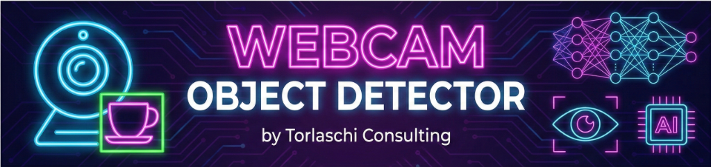

# Webcam Object Detector 🎥

<!-- ia-backup-gitignore-policy-2026-07-31 -->
> **Política Git IA pública — 2026-07-31:** las 27 rutas operativas IA están
> excluidas de Git. Este repositorio no recibe Sync, Google overlay, memoria
> operativa ni particulares desde ia-backup. La exclusión declara expresamente
> .agents, .claude, .codex, .continue, .copilot, .gemini y
> .github.




**Una aplicación profesional de visión artificial en tiempo real para Object Detection, Instance Segmentation y Pose Estimation.**

Desarrollado por **[Torlaschi Consulting](https://github.com/ia-torlaschi)**.

---

## 🚀 Resumen

Este proyecto aprovecha la potencia de **YOLO11** (You Only Look Once) para ofrecer un análisis de alto rendimiento sobre streams de video o feeds de webcam. Está diseñado para ser **modular**, **eficiente** y **hardware-aware**, utilizando GPUs NVIDIA (CUDA) cuando están disponibles y haciendo fallback a CPU automáticamente cuando es necesario.

### Características Clave

- **🕵️ Object Detection**: Identificá y localizá objetos con bounding boxes y puntajes de confianza (confidence scores).
- **✂️ Segmentation**: Generá máscaras (masks) pixel-perfect para los objetos detectados.
- **🤸 Pose Estimation**: Trackeá keypoints esqueléticos humanos en tiempo real.
- **⚡ GPU/CPU Portable**: Autodetecta aceleración por hardware. Optimizado para NVIDIA RTX Series.
- **🔧 Control por CLI**: Totalmente configurable mediante argumentos de línea de comandos.

## 🛠️ Instalación

### 1. Clonar el Repositorio

```bash
git clone https://github.com/ia-torlaschi/WebcamObjectDetector.git
cd WebcamObjectDetector
```

### 2. Configurar el Entorno

Se recomienda usar un entorno virtual (virtual environment).

**Windows (PowerShell):**

```powershell
python -m venv venv
.\venv\Scripts\Activate.ps1
```

**Linux/Mac:**

```bash
python3 -m venv venv
source venv/bin/activate
```

### 3. Instalar Dependencias

Este proyecto está optimizado para CUDA 12.4. El siguiente comando garantiza la versión correcta de PyTorch para aceleración por GPU:

```bash
pip install -r requirements.txt
```

### 4. Descargar Modelos

La aplicación intentará descargar los modelos automáticamente en la primera ejecución. Para configuración manual, verificá que tenés los siguientes archivos en el directorio raíz:

- `yolo11n.pt` (Detection)
- `yolo11n-seg.pt` (Segmentation)
- `yolo11n-pose.pt` (Pose Estimation)

> **Recomendación**: Usá los modelos `n` (Nano) para CPU o GPUs básicas. Usá `s` (Small) o `m` (Medium) para GPUs de gama alta.

## 💻 Uso

Corré la aplicación principal usando `python main.py`.

### 🔲 Object Detection

Modo de detección estándar (Bounding Boxes).

```bash
python main.py --task detect --model yolo11n.pt
```

### 🎭 Segmentation

Modo de segmentación de instancias (Masks + Boxes).

```bash
python main.py --task segment --model yolo11n-seg.pt
```

### 🦴 Pose Estimation

Modo de estimación de pose humana (Skeletons).

```bash
python main.py --task pose --model yolo11n-pose.pt
```

---

### 🌐 Web App (NUEVO v2.0)
¡Probá la nueva interfaz gráfica premium!
```bash
python app.py --device 0
```
Abrí tu navegador en **http://localhost:5000** para ver el video y controlar todo desde una interfaz moderna.

---

## ⚙️ Opciones de Configuración

| Argumento    | Default        | Descripción                                                                                   |
| :----------- | :------------- | :--------------------------------------------------------------------------------------------- |
| `--model`  | `yolo11n.pt` | Path al archivo del modelo YOLO (.pt).                                                         |
| `--task`   | `detect`     | Modo de ejecución:`detect`, `segment`, `pose`.                                          |
| `--source` | `0`          | Fuente de entrada.`0` para webcam default, `1` para externa, o path a un archivo de video. |
| `--conf`   | `0.5`        | Umbral de confianza (0.0 - 1.0). Filtra detecciones de baja confianza.                         |
| `--device` | `cpu`        | Dispositivo de hardware. Usá `0` para GPU o `cpu` para procesador.                        |

> **Nota sobre Modelos**: La Web App v2.0 permite cambiar en caliente entre versiones Nano (n), Small (s) y Medium (m).
> - **Nano**: CPU / GPUs viejas.
> - **Small/Medium**: Recomendado para RTX 3060/4060.

**Ejemplo: Corriendo en GPU con alta confianza**

```bash
python main.py --task detect --device 0 --conf 0.70
```

## 🏗️ Estructura del Proyecto

```text
WebcamObjectDetector/
├── app.py               # [NUEVO] Servidor Flask para Web App v2.0
├── main.py              # CLI Entry point (Legacy)
├── src/
│   ├── camera.py        # [NUEVO] Streaming y gestión de modelos
│   ├── detector.py      # Lógica YOLO y gestión de hardware
│   ├── visualizer.py    # Utilidades de dibujado
│   └── utils.py         # Helpers
├── web/                 # [NUEVO] Frontend
│   ├── templates/
│   │   └── index.html
│   └── static/
│       ├── css/
│       └── js/
├── requirements.txt     # Dependencias
└── README.md            # Documentación
```

## 🤝 Contribuciones

¡Las contribuciones son bienvenidas! Por favor abrí un issue o enviá un pull request para cualquier mejora o corrección de bugs.

---

## 👨‍💻 Autor

**Jorge Torlaschi**
*Torlaschi Consulting*

[](https://www.linkedin.com/in/jorge-torlaschi/)
[](https://github.com/ia-torlaschi)
[](https://torlaschiconsulting.com/)

---

*Potenciando soluciones con Inteligencia Artificial.*
